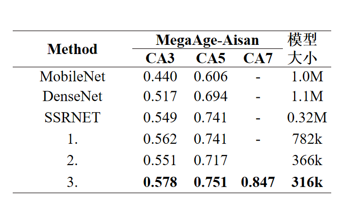

# MPR_model
Multi-pooling residual model

## 1. model_rigin.py
  a. 借鉴空洞卷积思想，构造的空洞池化过程，利用4个池化过程将特征图进行池化得到4个子特征图
  b. 利用1x1卷积对通道间的像素点进行交流避免空洞池化带来的局部信息“断代”，过程如图1
  
## 2. model_with_dw.py
  a. 将分解的图像作为残差信息添加
  b. 借鉴mobilenet的dw思想对网络进行优化，如图2
  
## 总体模型结构

## 年龄数据集实验结果

  

